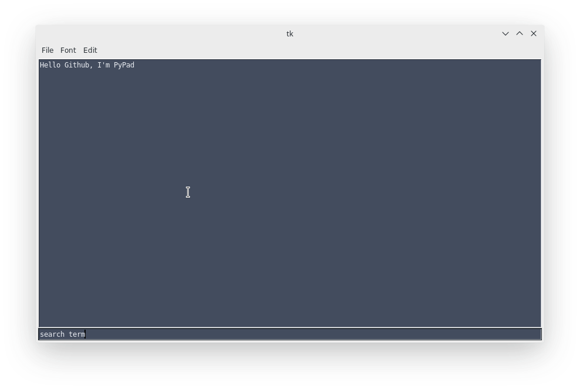

# pypad
Simple Text Editor built with Python 3.7 & Tkinter

Current functionality:

Handle files (open, save)
common text operations such as cut, copy, paste, select all, selection with ctrl + shift + arrow keys
searching (really barebone, activate with ctrl + f)
font settings, currently only 2 fonts for proof of concept)

